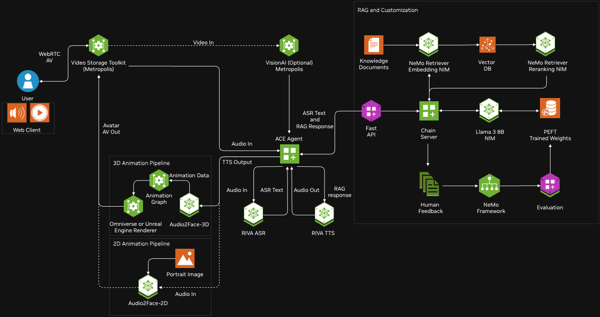

# AudioPaperCast

**AudioPaperCast** is an open-source concept demonstrating how large language models (LLMs) can transform an academic research paper into a fully produced two-person podcast conversation—without any manual coding. Every step of this project’s conceptualization has been guided by AI, from setting directory structures to defining prompt templates and pipeline steps.

**Key Highlights:**

- **No Manual Coding Involved:**  
  The entire concept—including code outlines, instructions, and this README—has been generated through natural language interactions with an AI model. It serves as a case study in AI-driven software design, showcasing how a human can direct an LLM to produce end-to-end project workflows.

- **End-to-End Paper-to-Podcast Pipeline:**  
  Once implemented, this pipeline would:
  1. **Extract Text from a PDF:** Parse a research paper to obtain the raw text.
  2. **Generate a Conversational Plan:** Use the LLM to outline the structure of a podcast episode that covers the paper’s key sections and findings.
  3. **Create a Two-Person Dialogue:** Develop a script where:
     - **Manu (Host)**: Friendly, curious, guiding the audience through the content.
     - **Open AI (Guest)**: Knowledgeable and insightful, providing depth and context.
  4. **Enhance & Refine the Script:** Smooth out transitions, remove redundancies, and improve clarity.
  5. **Convert to Audio (TTS):** Use a text-to-speech service (like ElevenLabs) to produce individual audio files for each line of dialogue.
  6. **Merge Audio Segments:** Combine all audio segments into a coherent and polished `.mp3` podcast episode.
  
- **Future Integration - Human Hosts & NVIDIA AI Avatars:**  
  Beyond an AI-only conversation, future development could integrate human participation. Imagine a real human co-host interacting with Open AI as a guest, with the entire conversation visually represented by NVIDIA AI avatars. This would create a multidimensional, immersive experience involving text, audio, and video.

- **Community & Customization:**  
  The entire project is open-source, meaning anyone can use, modify, or extend it. Adjust the prompts, experiment with different AI models or TTS voices, integrate local LLMs or open-source TTS engines, or even incorporate fact-checking and coherence validation steps. By January 1st, the project aims to be stable, well-documented, and ready for broad public use and improvement.

## Architecture Overview

To better understand the conceptual workflow, refer to the **Digital Human Blueprint Diagram** provided:

**Diagram Highlights:**
- **Input (PDF)**: The starting point is a research paper PDF.
- **LLM Planning & Script Generation**: The LLM orchestrates the entire process, creating a plan, script, and enhancements.
- **TTS Integration**: A pipeline stage converts script lines into human-like speech.
- **Final Merging**: All audio segments combine into a seamless, ready-to-share podcast episode.
- **Future Video Integration**: The diagram can be extended to show AI avatars and potential human participants interacting in a virtual environment.

## Roadmap & Timeline

- **Now – December:**  
  Continued improvements in prompt clarity, architectural details, and documentation. Testing the end-to-end logic with sample inputs and outputs (conceptually, since no manual coding is done yet).
  
- **By January 1st:**  
  - Finalized project structure and documentation, making it straightforward for anyone to implement this concept by simply copying the instructions and code templates generated.
  - Detailed guides on how to integrate NVIDIA AI avatars and human participants.
  - Community channels set up (e.g., GitHub Discussions) for support and collaboration.

## Licensing & Use Cases

- **MIT License:**  
  The MIT License ensures you can freely modify, distribute, or integrate this concept into your own projects without stringent restrictions.
  
- **Use Cases:**  
  - Educators wanting audio summaries of research papers for students.
  - Researchers looking to communicate findings in a more accessible format.
  - Content creators seeking new formats for science communication and public outreach.
  
## Disclaimer

- **Purely AI-Generated Concept:**  
  No human has manually written the code or instructions. The entire setup, including this README, is the result of iterative dialogues with an LLM.
  
- **Requires Implementation:**  
  To make this pipeline operational, developers need to copy the provided outlines, scripts, and instructions into actual code files, install dependencies, add API keys, and run them. The instructions serve as a comprehensive guide generated by AI, rather than a pre-built, one-click solution.

## Community & Future Directions

**AudioPaperCast** is just the beginning. As AI models evolve, better voices, more realistic avatars, improved reasoning, and real-time human-AI interactions will become possible. Your contributions—whether in providing feedback, adding new features, or exploring novel integrations—are welcome. Let’s collectively shape the future of AI-assisted media production.

**By January 1st, AudioPaperCast** aims to stand as a fully realized example of what can be achieved through conversational instructions with an LLM, guiding the entire lifecycle of a project from idea to detailed implementation plan, and extending seamlessly into future enhancements like human participation and NVIDIA AI avatar integration.

---

This README serves as a final, comprehensive overview of the **AudioPaperCast** concept, its capabilities, future plans, and how the community can get involved.